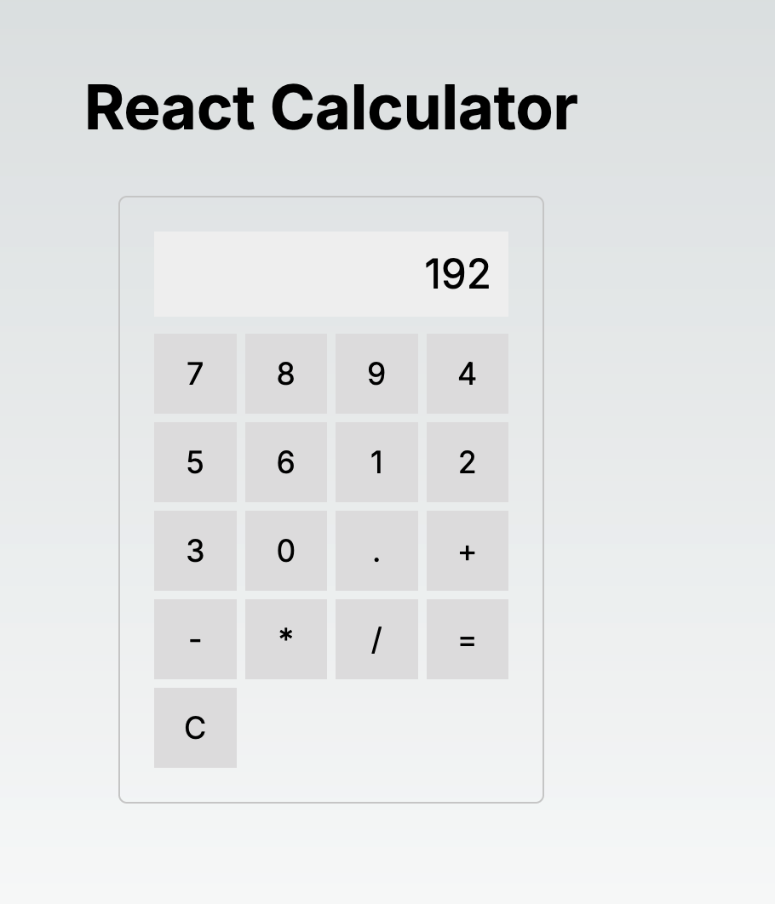
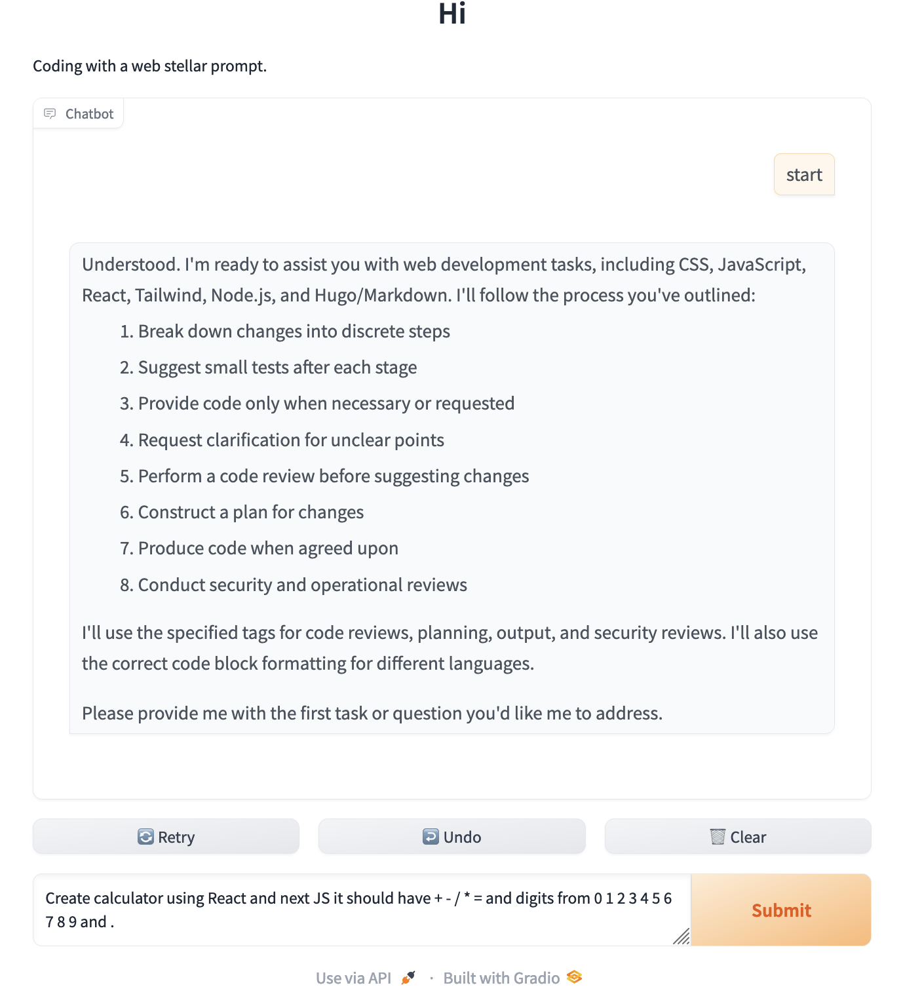

# Example repository of codegeneration session
  of the simple "Calculator" application using LLM (Claude 3.5 Sonnet `claude-3-5-sonnet-20240620`)
  All code was generated using LLM.

## Prompt Log
  Initial and main prompt was : 

    `Create calculator using React and next JS it should have + - / * = and digits from 0 1 2 3 4 5 6 7 8 9 and .`

  Additional prompt 1 (convert to typescript):
 
```
I use typescript and where is no directory components, and no file index.js
Check current project structure :
Directory structure:
.eslintrc.json
app
app/globals.css
... <dumped project structure file list and  all files content as single string> ...
```

  Additional prompt 2 (fix build error):
```commandline
Import trace for requested module:
./components/Calculator.tsx
./app/page.tsx
⨯ ./components/Calculator.tsx
Error:
× You're importing a component that needs useState. It only works in a Client Component but none of its parents are marked with "use client", so they're Server Components by default.
│ Learn more: https://nextjs.org/docs/getting-started/react-essentials
│
│
╭─[/Users/user/git/claude/calculator/components/Calculator.tsx:1:1]
1 │ import React, { useState } from 'react';
· ────────
2 │
3 │ const Calculator: React.FC = () => {
4 │ const [display, setDisplay] = useState('0');
╰────

Import trace for requested module:
./components/Calculator.tsx
./app/page.tsx
```

  That's all, all errors fixed, project was compiled and started successfully.

## Final result


## Code generation session log 

    Stored in file `prompts/promt.log.txt`
    System prompt used for this session `system.promt.txt` - default  
could be found in file 

## Gradio chat connected to the Claude 3.5 sonnet API

    `claude_chat/chat.py`

### Chat installation 
    
  To use Gradio chat first install python3, then create virtual environment  

  `python3 -m venv venv_chat`

#### Activate virtual environment

    `source venv_chat/bin/activate`

#### Setup environment variable `ANTHROPIC_API_KEY`:

#### Copy file `.env.default` into `.env` and set your API key received from Claude
    `ANTHROPIC_API_KEY=<your api key>`

#### Install dependencies 
    ```
    pip install python-dotenv gradio anthropic
    ```
#### Start chat:
    `python chat.py`
    
This command will start Gradio chat:

[//]: # (![GradioChat_UI_Example.png]&#40;images/GradioChat_UI_Example.png&#41;)

Type first prompt as "start" to activate system prompt.
And then start your code generation session.

### System prompt library
    `claude_chat/prompot_lib.py`

Various examples of system prompt are stored in file `claude_chat/prompot_lib.py`

